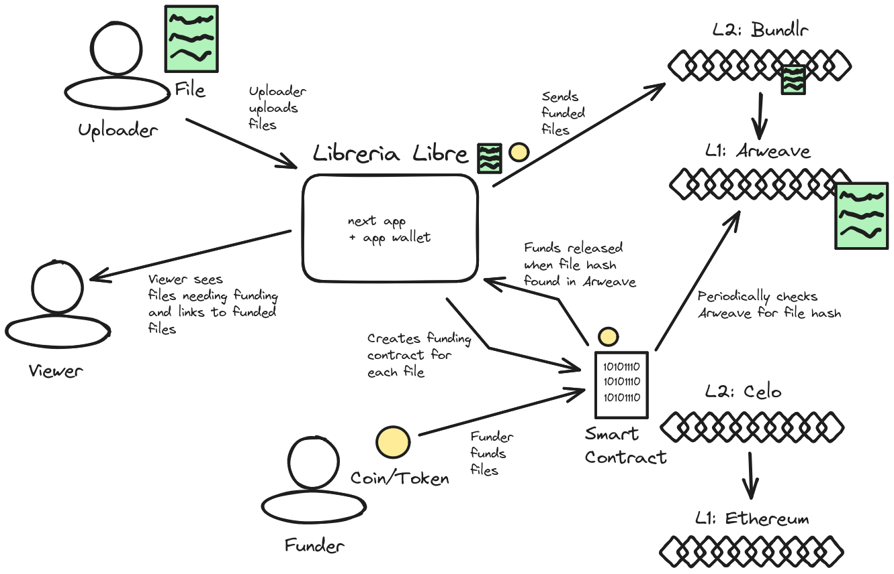

# Libreria Libre
This is an open-source web-app to help permanently archive texts, books and other literary work. We imagine it to be of particular use for the political struggles of marginalized groups facing censorship or other information suppression.

Uploaders anonymously submit files to the app they wish to be archived. If they don't have the funds for archival, the files are listed as seeking funding, and a smart contract is created. Funders may provide archival funds. When a files target it reached, the app sends the files to Bundlr (and ultimately Arweave) with funds from an app wallet. When the smart contract detects the hash of the file in Arweave, it releases funds to the app wallet. The app wallet keeps a stable balance over time, the smart contract performs escrow.



## Team Rocket
Doug
Mora
Sebi 
Luigi 
Norman

## Slideshow
https://www.canva.com/design/DAFnJRZMTxU/A_QlMaH_4mI2iLK7gM-rNw/view?utm_content=DAFnJRZMTxU&utm_campaign=designshare&utm_medium=link&utm_source=publishsharelink

## Problem
Example: last month (May 2023), a new law passed in Florida that makes it illegal for the majority of health institutions to provide hormone replacement therapy for trans adults. As a result, many trans people are switching to DIY HRT. Guides to doing safe HRT circulate on the social media and it would profit the trans community to have a decentralized, censorship-resistant and free access to such guides

## Techstack Used
- Typescript
- [Celo Composer](https://github.com/celo-org/celo-composer) 
    - Next  
        - React
    - wagmi
    - tailwind
    - ...
- Solidity
- Hardhat
- bundlr
- ...

## How to continue
- only people with a specific NFT can do approvals on which resources get stored to arweave (each resource needs at least 2 or 3 approvals?) 
- app itself on Arweave?

## Dev setup 
```bash
# install
pnpm i
# OR
yarn

# run next app
cd packages/react-app
pnpm run dev
# OR
yarn dev
```